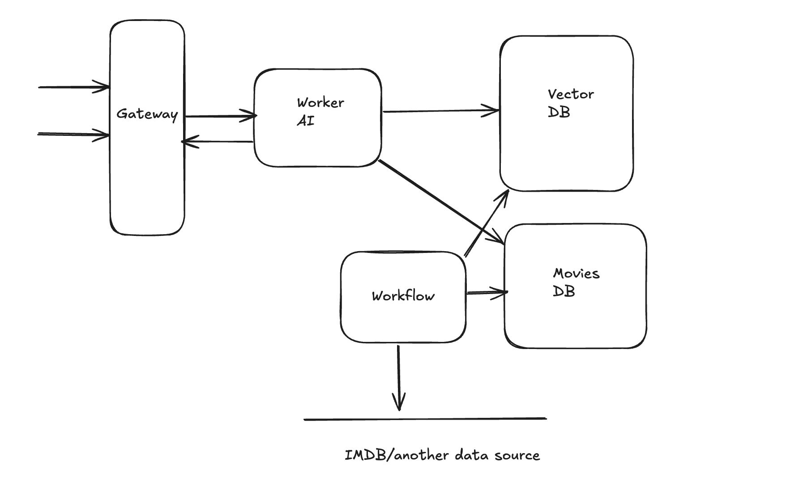

# VibeCinema

The repo contains source code for the VibeCinema app which is a handy "search" that looks up
movies from IMDB top 1000 dataset based on your vibe 😎

## Project overview 📖



The picture above shows the high level app design, except for the "workflow" part which was supposed to be
a recurring job for scrapping, storing movies data and building RAG. Unfortunately, the IMDB and Rotten Tomatoes APIs
are closed, hence this part was not implemented. Instead, a dataset of the top 1000 movies has been used to init the DB
and create RAG.

## RAG 🤖

RAG stands for Retrieval-Augmented Generation which is a technique to both improve quality of LLM-based system responses
and extend LLM's knowledge about any domain (since it allows us to inject data sources that haven't been used in training).
Cloudflare has [a nice and short summary](https://developers.cloudflare.com/ai-search/concepts/what-is-rag/) on this approach in their docs. Go check it out!

The `rag` folder contains some primitive scripts to create "embeddings" (a vectorized representation of text data - user prompt).
Plus it seeds the application database using the "IMDB top 1000 movies" dataset.

The process of building RAG in this case is quite straightforward. First some data about movies has to be extracted from the dataset and then used to create embeddings. In this case, the following prompt (text) is used to create vectors (numerical data):

```
Movie
Title: ${movie.title}
Overview: ${movie.overview}
Genre: ${movie.genre}
```

VibeCinema creates embeddings using Google's `embeddinggemma-300m` model, but overall you can take whatever model you prefer.
When vectors are created, they are inserted to Cloudflare vector database, meanwhile the original movies data is inserted into SQL storage (D1).

## "Vibe" Search 🧙

Alright, alright, alright... now the core feature of the app - search.
The app backend exposes a single endpoint which is used by the client to pass a search string. The search string
can be, frankly, whatever not even a person's vibe 😅. When backend receives the query it does the following sequence of operations:

```
- create a vector from user query using the same model that is used for creating RAG.
- search for similar vectors using cosine difference function
- extract relevant information about movies from D1
```

... and that's it. Simple, but feels like magic ✨

## A few notes on the client code

The last section is just a disclaimer, that a lot (the majority) of the UI code has been generated using [v0](https://v0.app/)
and then slightly adjusted and adapted to the app's needs. Style-wise it's OK, but generic. That's totally fine as the main goal wasn't about building pretty interface.

Code quality wise, I think there is a lot to be done, however I mostly skimmed through the generated code ensuring that it looks "good enough" as I don't have much interest in UI (at least in the context of this application).
